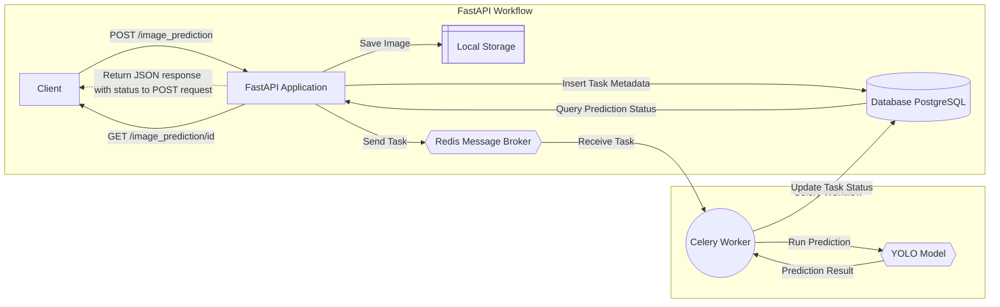

# Async Image Prediction
An asynchronous image prediction system to identify whether an image contains a dog, using FastAPI, Celery, and YOLO.

## Features
- **REST API** for uploading images and retrieving predictions.
- **Asynchronous Processing** using Celery and Redis.
- **Durable Task Handling** to persist predictions across service restarts.
- **YOLOv5 Integration** for image detection.

## Quick Start
1. Clone the repository:
   ```bash
   git clone https://github.com/your-username/async_image_prediction.git
   cd async_image_prediction


## Project Organization

```
├── LICENSE
├── Makefile
├── README.md
├── data
│   ├── external
│   ├── interim
│   ├── processed
│   └── raw
├── docs
├── models
├── notebooks
├── pyproject.toml
├── references
├── reports
│   └── figures
├── requirements.txt
├── setup.cfg
├── tests                 <- Tests for different modules
│   ├── test_api.py
│   ├── test_tasks.py
│   └── test_modeling.py
└── async_image_prediction
    ├── __init__.py
    ├── api                 <- FastAPI-related code
    │   └── app.py          <- Entry point for the API
    ├── config.py           <- Configuration variables
    ├── dataset.py
    ├── features.py
    ├── modeling
    │   ├── __init__.py
    │   ├── predict.py      <- YOLO inference logic
    │   └── train.py
    ├── persistence         <- Database and storage logic
    │   ├── __init__.py
    │   └── db.py           <- SQLite or database handlers
    ├── tasks               <- Task queue scripts
    │   └── worker.py       <- Celery/Redis worker
    └── plots.py
```

--------
# Design



