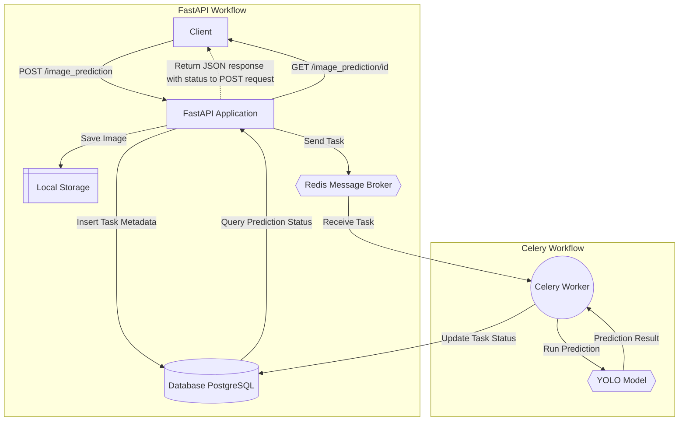

# Async Image Prediction

An asynchronous image prediction system to identify whether an image contains a dog, using FastAPI, Celery, and YOLO.

## Key Features

- **REST API** for uploading images and retrieving predictions using _FastAPI_ as the backend.
- **Asynchronous Processing** using _Celery_ and _Redis_ as the broker.
- **Durable Task Handling** to persist predictions across service restarts using _PostgreSQL_ database.
- **Package Dependency Management** using _Poetry_.
- **Image Detection** using YOLOv5 out-of-the-box model for image detection.

## System Architecture

The system is composed of two main workflows: **FastAPI Workflow** and **Celery Workflow**.



## Prerequisites

Ensure the following are installed on your system:

- Python 3.12+
- Redis
- PostgreSQL
- Poetry (for dependency management)
- Docker (optional, for containerized deployment)

### Installation and Setup

1. **Clone the repository**:
    ```bash
    git clone https://github.com/nishzsche/async_image_prediction.git
    cd async_image_prediction
    ```
2. **Install Poetry** (if not already installed):
    
    Poetry is required to manage dependencies. 
    
    Install it using:

    ```bash
    curl -sSL https://install.python-poetry.org | python3 -
    ```
    Confirm the installation:

    ```bash
    poetry --version
    ```
3. **Set up environment variables**: Copy `.env.example` to `.env` and update configurations as needed:
    ```bash
    cp .env.example .env
    ```
4. **Initialize the database**:

    ```bash
    make db-init
    ```

5. **Start all services** (Redis, Celery, FastAPI):
    
    This will set up everything needed to run the project including installing dependencies:
    ```bash
    make setup-all
    ```
6. Access the API at `http://localhost:8080`

## Running the Application

Use the following commands to run individual components:

- **Start Redis server**:

    ```bash
    make start-redis
    ```

- **Start Celery worker**:

    ```bash
    make start-celery
    ```

- **Start FastAPI server**:

    ```bash
    make start-api
    ```
Alternatively, run all services at once:

```bash
make setup-all
```
## API Usage
### 1. Upload an Image for Prediction
```bash
curl -X POST http://localhost:8080/image_prediction -F "image=@dog.jpeg"
```
Response:

```json
{
  "image_prediction_id": 1,
  "status": "PENDING",
  "has_dog": null
}
```
### 2. Retrieve Prediction Status
```bash
curl http://localhost:8080/image_prediction/1
```
Response:

When prediction is complete:
```json
{
  "image_prediction_id": 1,
  "status": "DONE",
  "has_dog": true
}
```
In case of an error:
```json
{
  "image_prediction_id": 1,
  "status": "ERROR",
  "has_dog": null
}
```

--------

## Testing
Run the test suite using `pytest`:
```bash
poetry pytest
```

## Troubleshooting

- **Redis server not starting**: Ensure Redis is installed and running on port 6379:

```bash
redis-server
```

- **Database connection issues**: Confirm PostgreSQL is running, and the connection details in `.env` are correct.

- **Celery worker not processing tasks**: Check the `celery_worker.log` for errors and ensure Redis is running.

## Makefile commands
Use the `Makefile` for managing the project:

|Command|	Description|
|---|---|
|`make help`|	Show available commands
|`make requirements`|	Install dependencies using Poetry
|`make setup-all`|	Start all services
|`make start-redis`|	Start Redis server
|`make start-celery`|	Start Celery worker
|`make start-api`|	Start FastAPI server
|`make db-init`|	Initialize the PostgreSQL database
|`make db-reset`|	Reset and reinitialize the database
|`make lint`|	Run linting checks
|`make format`|	Format code using Black
|`make shutdown`|	Stop all running services

## License
This project is licensed under the MIT License. See the LICENSE file for details.

## Contact Information
For questions or support, contact Nishanth pradeep raj. R at nishanthrajamani@gmail.com